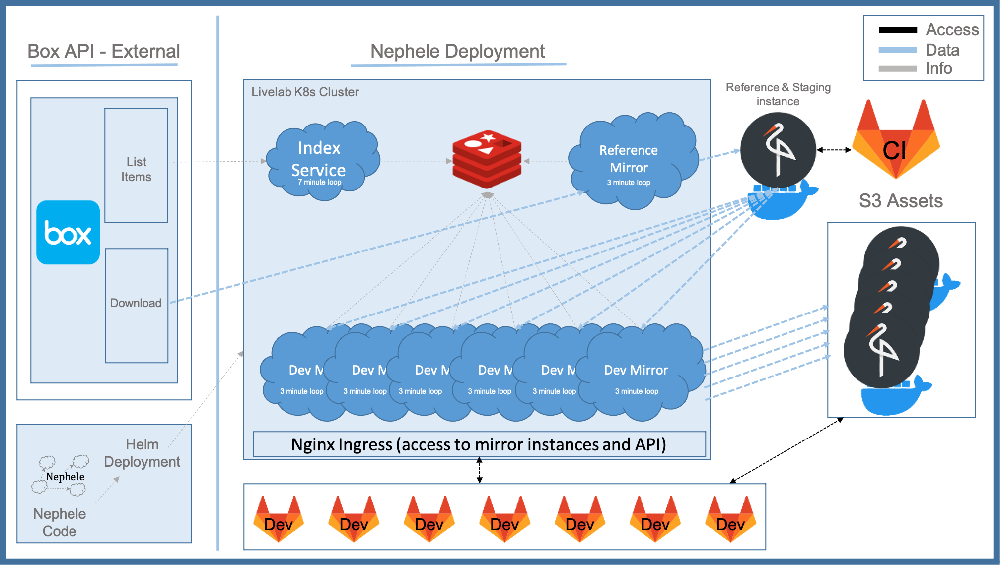

.. _deployment_architecture:

Deployment Architecture
=========================

Nephele can be deployed a few different ways.
Production deployment is suggested to use K8s and Helm to deploy.
For testing or other purposes, Nephele can be deployed and instantiated using docker and docker compose.
Development can be done using the stand alone jar with supporting services deployed else where.

Production
-------------
Nephele is designed to be deployed and run on a Kubernetes cluster using its Helm chart.

It requires a separately deployed ``redis`` service.
A sample redis Helm chart can be found `here <https://github.com/bitnami/charts/tree/master/bitnami/redis>`_.

Once the redis service is deployed, Nephele can be deployed to the K8s cluster.

.. code-block:: shell

   $ helm install nephele

:ref:`The diagram below <k8s_deployment>` shows a sample deployment of Nephele along with the default life cycles for each part of Nephele.

.. _k8s_deployment:

Stand alone - Docker
---------------------
.. admonition:: Under constructions
   :class: warning

   This section of docs is under constructions

Development / Jar
------------------
.. admonition:: Under constructions
   :class: warning

   This section of docs is under constructions

